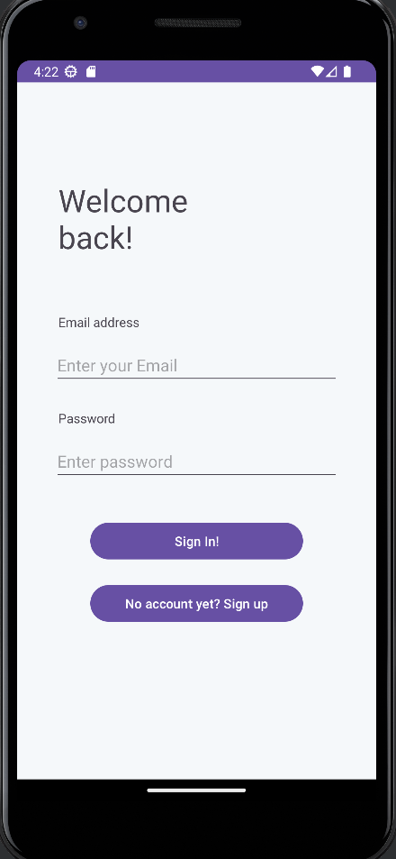
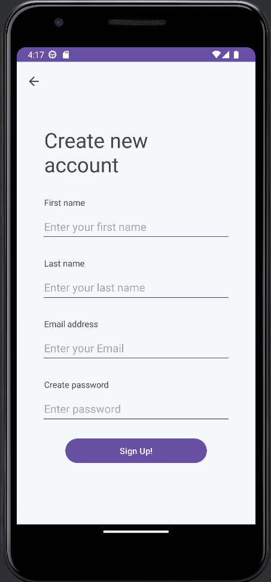
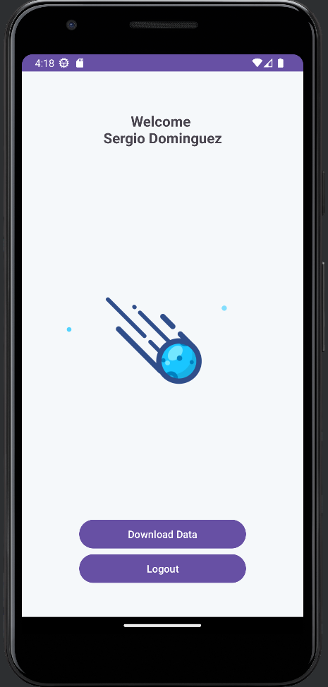
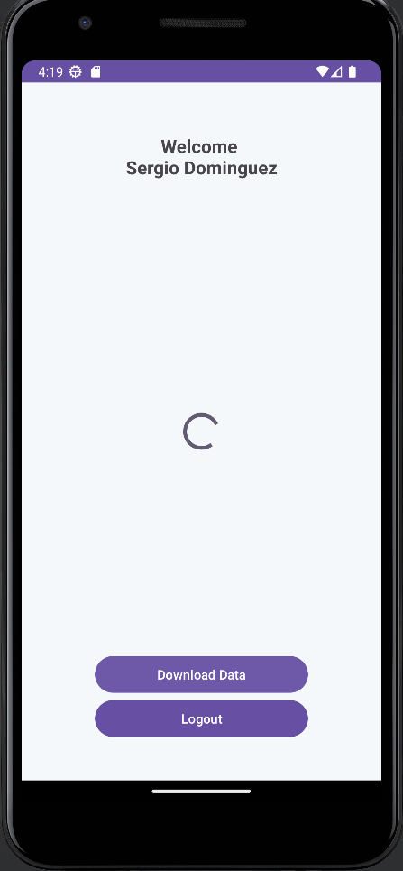
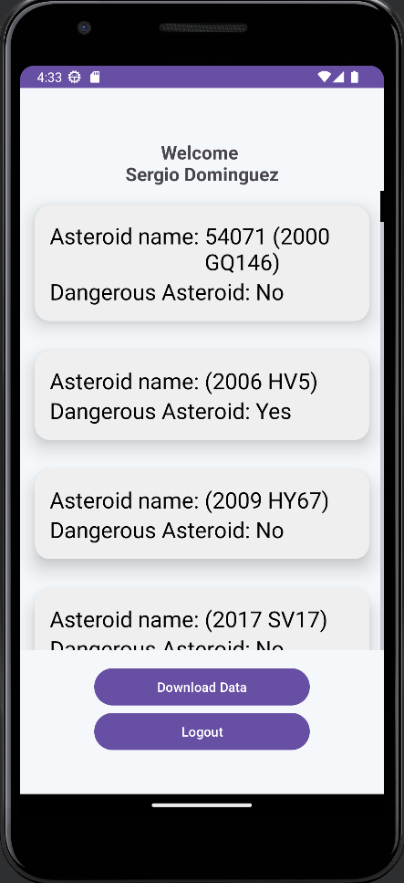
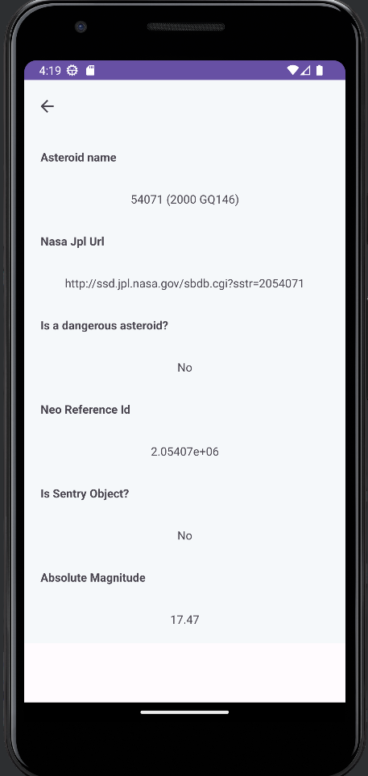

# nasapp - Android App

Nasapp is an app that reads data from the NASA API NeoWs in order to find near earth asteroid information.
It takes the data from 04/26/2023 until 04/30/2023, this parameters can be changed depending on user needs.

Nasapp es una aplicación que lee los datos a partir de la API de la NASA llamada NeoWs, con el fin de encontrar información acerca de los asteroides cercanos a la tierra. La app toma datos desde el 26 de abril de 2023 hasta el 30 de abril de 2023, sin embargo, dichos parametros pueden ser cambiados y configurados acorde a las necesidades del usuario.

 
 

## Installation / Instalación

In order to install the app, you should have Java SDK 16 and Android Studio with a Android 6.0 or superior device enviroment.

Para instalar la aplicación, el usuario debe tener instalado Java SDK 16 o superior y Android Studio con un dispositivo de simulación con version Android 6.0 o superior.

## Features / Características

The android app lets you:

- Connect to the NeoWS NASA API
- Download relevant data from the API
- Visualize the data and access further information about asteroids
- Store locally information about asteroids.
- Having an user to log in and log out and having an unique records of the saved asteroids

La aplicación Android permite:

- Conectarse a la API de la NASA NeoWS
- Descargar información relevante desde la API
- Visualizar la información y acceder a más datos acerca del asteroide seleccionado
- Guardar localmente la información acerca los asteroides
- Tener un usuario para entrar y salir de la aplicación, y tener un registro único de los asteroides

## Screenshots / Capturas de pantalla

## User guide / Guía de usuario

On first screenshot you can either log into your account or create a new one, it will take you the home screen which is the third screenshot, if it's your first time in the app, you will see the blue icon so you should click on Download Data to pull data from the API.

Then you can visualize some information about some asteroids, if you click in some of them, you'll be able to access further information about the specified asteroid.

En la primera captura de pantalla como usuario se podrá loguear en la aplicación o registrarse como nuevo usuario, al ingresar, el usuario será re dirigido a la pantalla de la tercera captura, si es la primera vez ingresando a la app, se visualizará el ícono azul y los botones de descargar datos o desloguearse, al oprimir en descargar datos, la app empezará a traer información de la API y la almacenará localmente en el telefono.

El usuario podrá dar click sobre cualquier item en la lista y acceder a información adicional sobre el asteroide seleccionado.

## Programming language, libraries, databases and tools

- Developed the app using Java 17 on Android Studio
- Volley library to make HTTP GET Requests
- SQLite to store information about Users and Asteroids

## Lenguajes de programación, librerías, bases de datos y herramientas

- Desarrollé la aplicación en Java 17 utilizando Android Studio
- Librería Volley para realizar solicitudes HTTP Get
- SQLite para guardar la información de los Usuarios y Asteroides
